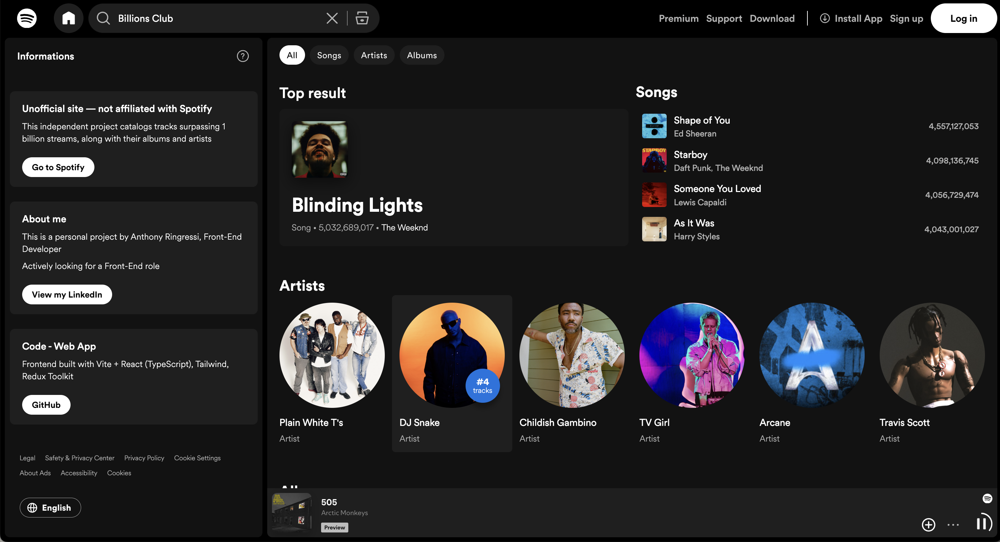

<br>

<p align="center">
  
</p>

### <p align="center"> Spotify clone • <a href="https://spotify-billions.club" >Elysium</a> </p>

<br>

# Elysium

This site lists all songs that have surpassed **1 billion streams** on Spotify, along with their albums and artists. \
The interface closely mirrors Spotify’s design: animations and components were studied and recreated using the browser’s developer tools. \
Data is updated nightly around **2 a.m.**\
This is a personal, independent project and is **not affiliated with Spotify**.

<br>

## 1. Tech stack

- ⚛️ React 18
- 🧩 TypeScript
- ⚡️ Vite
- 🎨 Tailwind CSS
- 🧰 Redux Toolkit
- 📬 Axios
- 🔀 React Router

<br>

## 2. Getting started

### Install

```bash
npm i
```

### Run

```bash
npm run dev
```

### Configuration

Create a .env at the repo root based on .env.example:

```
VITE_API_URL=
```

<br>

## 3. Part of the Olympe Stack

This repository is a component of **[Olympe](https://github.com/anthony-rgs/olympe)**, a modular stack for collecting and visualizing Spotify “Billions Club” data. \
**Elysium** is the web interface that reads datasets produced by **[Artemis](https://github.com/anthony-rgs/artemis)** (under /collections) and presents them to users, while **Heraclès** and **Sisyphe** handle processing and scheduling. \
It can't run standalone.

<br>

## 4. Links

Parent project: [Olympe](https://github.com/anthony-rgs/olympe)\
Data collector: [Artemis](https://github.com/anthony-rgs/artemis)\
Production site: https://spotify-billions.club
